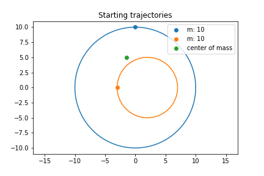
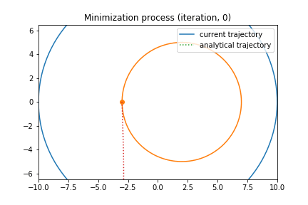
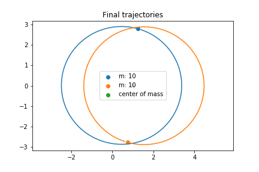
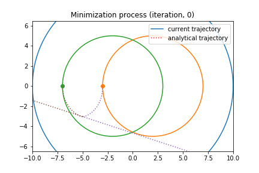
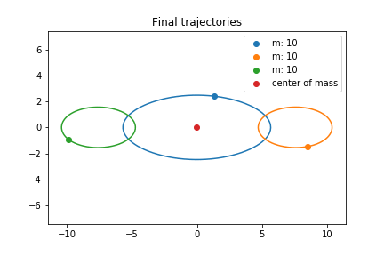
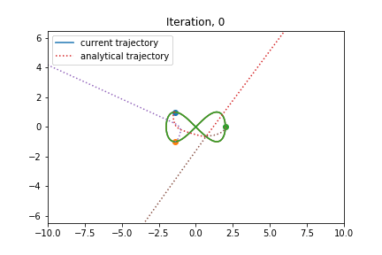
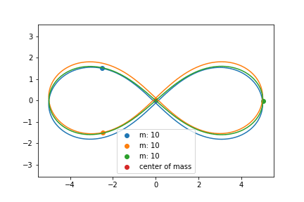

# Astronomical choreography

## What is this project about

Suppose that we have system of N astronomical objects, who is moved by gravity forces.
Generally this problem is called [N-body problem](https://en.wikipedia.org/wiki/N-body_problem) and its well known that starting from N=3, N-body problem can be solved only for special cases.

This work is covering more narrow situation called [N-body choreography](https://en.wikipedia.org/wiki/N-body_choreography) in which we are looking only for periodic solutions. So our question is: Which periodic orbits are possible for given N? I once discovered Moore's article and was amazed by how elegantly this problem can be solved with variational principle so I decided to implement it and visualize process of numerical learning. Further I will first briefly cover underlying theory and show animated results I achieved.

## Origins

This work is an implemetation of method, proposed in article "Braids in classical gravity" by Cristopher Moore, 1993. This project was prepared during my studying at Skoltech University at Moscow as final project for course "Scientific computing".

## Theory

//TODO

To investigate this question, see referenced literature:
- "Braids in classical gravity" by Cristopher Moore, 1993
- "New Orbits for the n-Body Problem" by Robert J. Vanderbei

## Results

Let's see what we have

Further for each case there will be three images:
1. starting orbits
2. process of learning, on plot you can see two types of lines:
    - **solid lines** are for optimized trajectories, so for most part of the time they don't represent real gravitational moving
    - **dot lines** are real trajectories from given starting positions and velocities of bodies (calculated with leapfrog method)
    
    that mean that we can consider our solution valid when this two types of lines overlap with each other
  
3. resulting orbits and bodies moving along them

For example see the simpliest case of 2 bodies

### Simple 2-body solution

### 3-body oval solution

### 3-body eight solution

